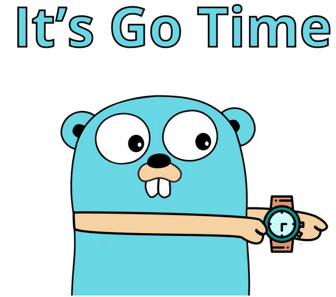

  
  <h3>Конспект по гоооошечке</h3>

В этом репозитории собраны основные вопросы к собеседованиям, примеры, а также задачки

--- 

1. [Введение. Основные понятия](_notes/note_1.md)
2. [Изменения в языке по версиям (с 1.22)](_notes/note_1.md)
3. [Основные конструкции языка](_notes/note_3.md)
4. [ООП и ораганизация объектов в GO](_notes/note_4.md)
  
    
---  

Bonus:  
1. [Список статей по GO](_notes/note_b1.md)
2. [Остортировать](_notes/unsorted.md)