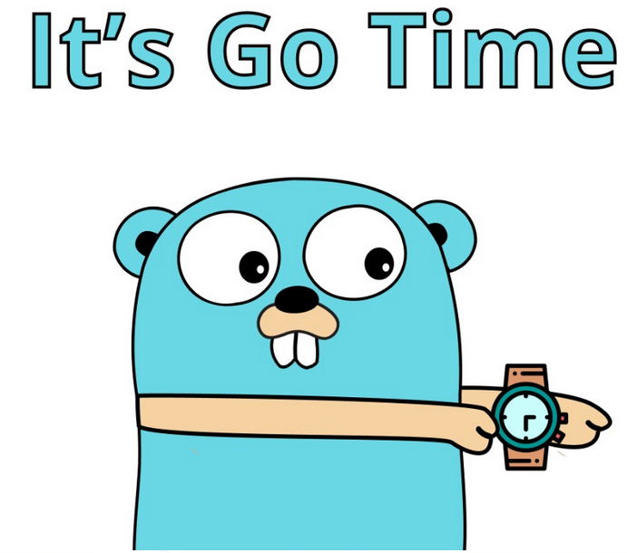

  
  <h3>Конспект по гоооошечке</h3>

В этом репозитории собраны основные вопросы к собеседованиям, примеры, а также задачки

--- 

1. [Введение. Основные понятия](_notes/note_1.md)
2. [Изменения в языке по версиям (с 1.22)](_notes/note_2.md)
3. [Работа с памятью в Go](_notes/note_3.md)
4. [Основные конструкции языка](_notes/note_4.md)
5. [Срезы и словари](_notes/note_5.md)
6. [ООП и ораганизация объектов в GO](_notes/note_6.md)
7. [Конкурентное программирование в GO](_notes/note_7.md)
8. [Планировщик и горутины](_notes/note_8.md)
    
--- 

[Задачи](_tasks/task_1.md)

---

Bonus:  
1. [Список статей по GO](_notes/note_b1.md)