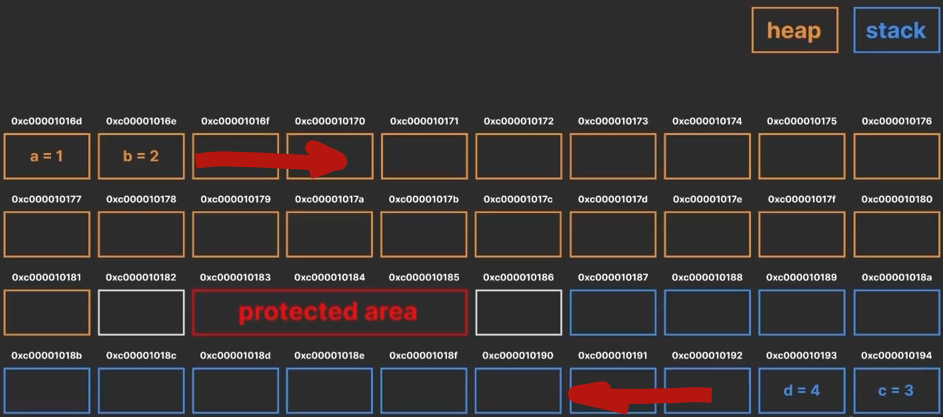
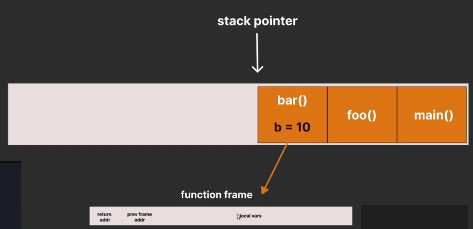
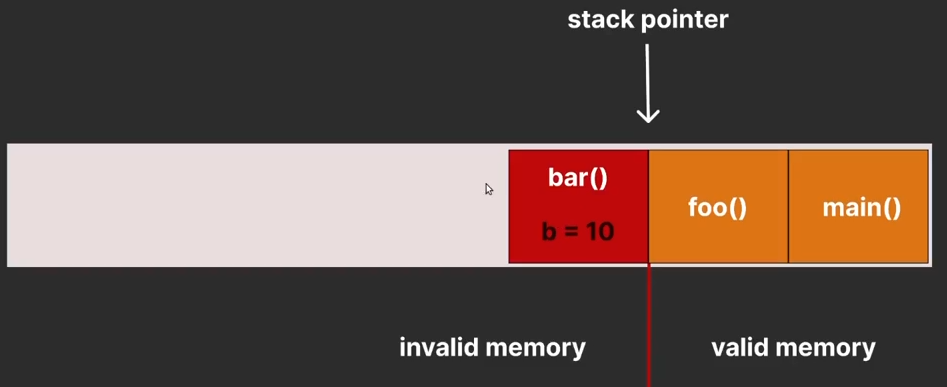

## Стэк и куча

Память поделена на две части исторически. Куча начинается с начала, стек с конца. В protected area нельзя аллоцировать никакие объекты. Когда стек дорастает до protected area происходит stack overflow.  



Stack быстрее и свобождается автоматически и быстрее. Из кучи (heap) сами объекты не удаляются, нужно либо удалять руками, либо с помощью Garbage Collector. 

В стэке храняться недолго живущие локальные переменные. В куче храняться объекты и ссылки, которые живут за пределами функции.

## Как работает стэк в Go

Каждой горутине выделяется собственный стэк. Берется он у системы (syscom) в специальной области памяти, которую можно шарить между потоками. Стеки условно бесконечные (1GB - x64, 256Mb - x32), но базовый/начальный размер стека - 2Кб. 



**Stack pointer** - указатель, который показывает в каком состоянии сейчас находится стэк. В стеки записываются **function frame**, в которых указан возвращаемый адрес, адрес предыдущего фрейма, локальные переменные. 

Если runtime видит, что новый frame function переполяет базовые 2Кб, тогда он выделяет новую область памяти и копирует все старые function frame'ы и новый. Старый стек удаляется.

Как только функция заканчивает свое выполнение *stack pointer* перемещается к предыдущей функции(*foo()*). Область памяти помечается как `invalid memory`, но память остается и переменная еще жива. **Стек самостоятельное не чиститься!** Когда начинает выполняться новая функция, под нее выделяется таже память, что и под только что выполнившуюся функцию.

**Висячий указатель (dangling pointer)** — это указатель в программировании, указывающий на область памяти, которая была освобождена (удалена) или перераспределена. Он возникает, когда объект удаляют, но указатель не обнуляют, оставляя адрес «мусорным». Использование таких указателей приводит к непредсказуемому поведению программы, ошибкам сегментации и критическим уязвимостям. 



## Как узнать, где будет аллоцированная переменная? 

Не каждая переменная будет создана на стеке. За это отвечает **escape analysis**. 

**Escape Analysis** - это метод статического анализа, используемый *комилятором*, для определения где будет выделена память под переменную: стек или куча. 

Правила: 
1) Компилятор анализирует область видимости переменной и отслеживает, может ли указатель на неё выйти из текущей функции. Если нет, тогда переменная создается в стэке. 
2) Объект слишком большой, то он аллоцируется в куче
3) Неизвестно насколько большим объект вырастет в райнтайме
3) Неизвестно насколько большим объект вырастет в райнтайме
4) Если значение переменной передается в функцию как interface, эта переменная аллоцируется в куче
5) Литералы функций, структуры данных, принадлежащие мапам, слайсам, строкам и каналам


##  Есть ли разница, где аллоцировать функцию?

Да, есть. 
- в куче память аллоцируется дольше
- функции выполняются немного медленнее
- нагружает GC


## Ссылки (указатель)

В ссылке указывается адрес по которому будет лежать значение. 

Обычно ссылка на переменную занимает в x32 - 4 байта, а в x64 **8 байт** - машинное слово


## Передача по ссылке / по ссылке
Правильнее *по значению*, потому в Go всегда передается по значению

```golang
// передача значения переменной name
func changeName(name string) {
    // здесь создается локальная копия, которая за пределами функции уже не живет
    ...
}

// передача ссылки переменной name
func changeName2(name *string) {
	newName := "Alice"
	name = &newName // локальной копии name мы присволили новую ссылку
    *name = newName // обращаемся к значению переменной и меняем ей значение
    // ВАЖНО! переменная функции name не поменяется
}

func main() {
	name := "John"
	changeName(name)
	changeName2(&name)
}
```
### Dereference
```golang
func someFunc(name *string, newName string) {
    *name = newName // мы обращаемся к значению поля по ссылке и меняем его значение
}
```

### Работа с методами

Пример с методами аналогичен примеру с функциями
```golang
// Здесь происходит dereference
// Изменяем значение поля street по ссылке
func (a *Address) setStreet(street string) {
	a.street = street
}

// здесь создается копия переменной a Address и ей присваивается значение.
// после завершение функции setStreet() копия переменной уничтожается вместе с измененным значением 
func (a Address) setStreet(street string) {
	a.street = street
}

```