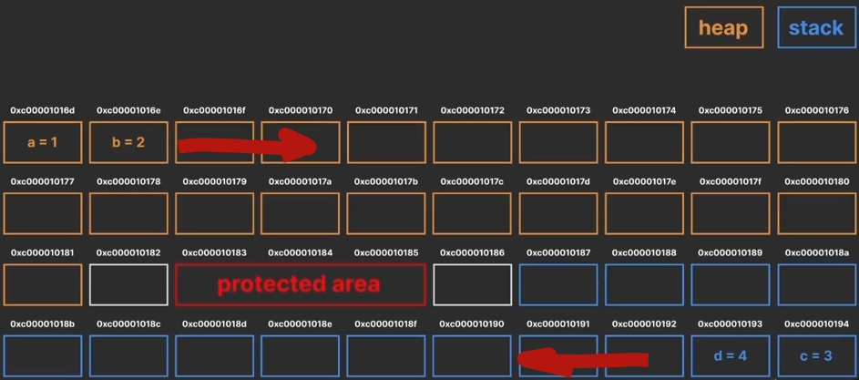
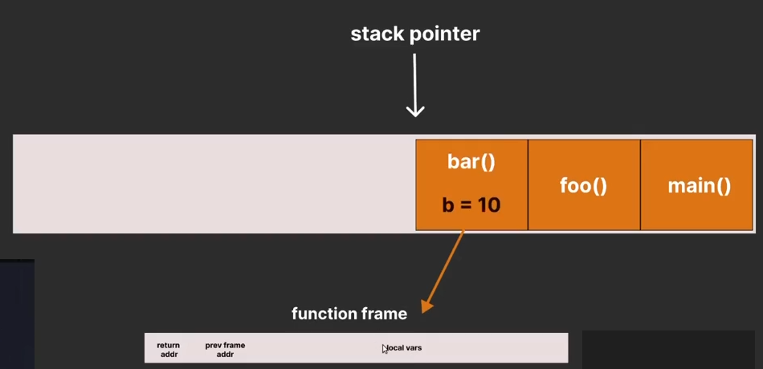
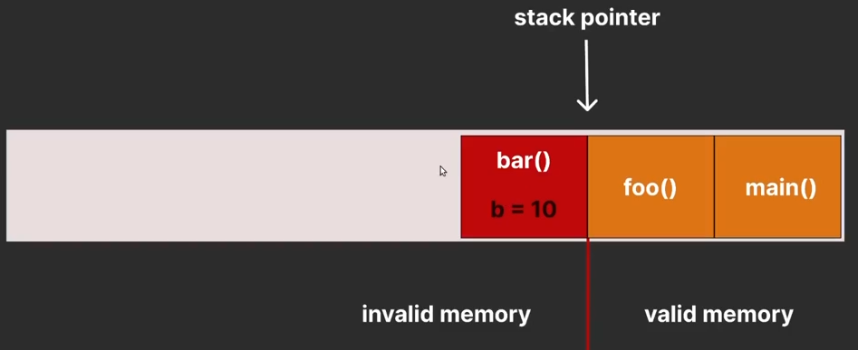
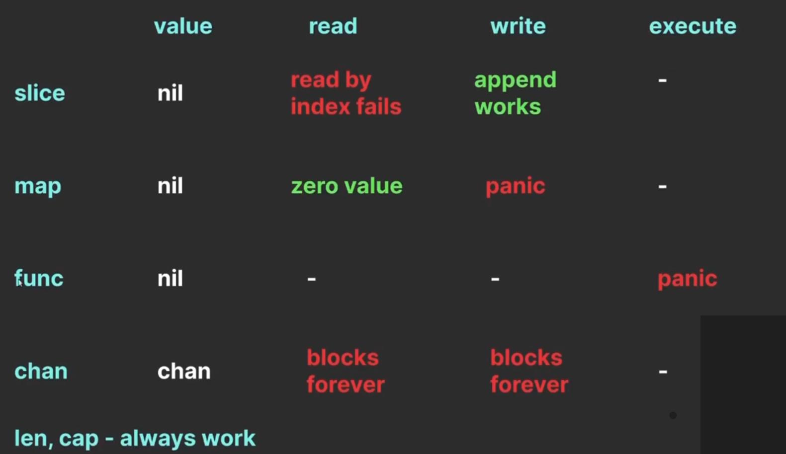
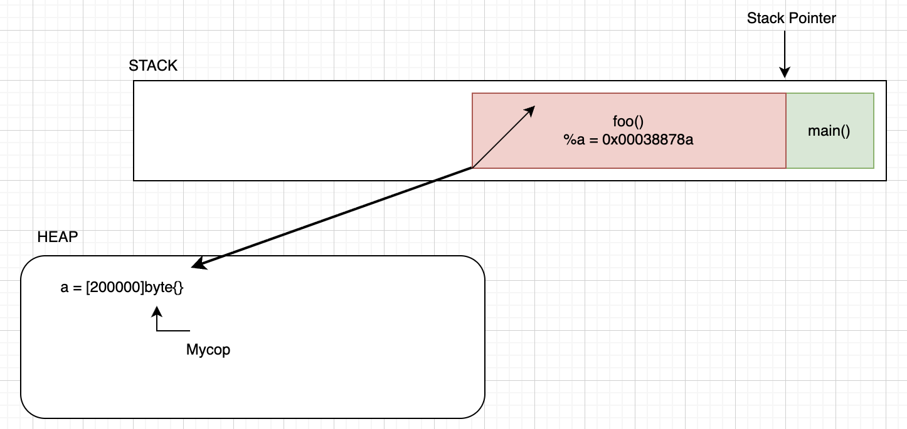
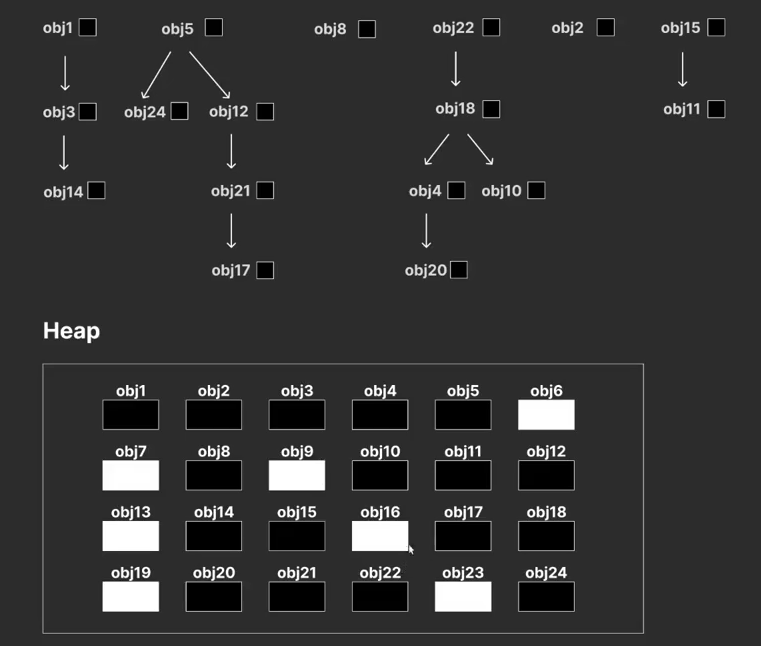
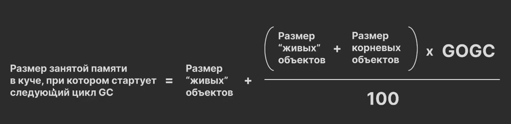

## Стэк и куча

Память поделена на две части исторически. Куча начинается с начала, стек с конца. В protected area нельзя аллоцировать никакие объекты. Когда стек дорастает до protected area происходит stack overflow.  



Stack быстрее и свобождается автоматически и быстрее. Из кучи (heap) сами объекты не удаляются, нужно либо удалять руками, либо с помощью Garbage Collector. 

В стэке храняться недолго живущие локальные переменные. В куче храняться объекты и ссылки, которые живут за пределами функции.

## Как работает стэк в Go

Каждой горутине выделяется собственный стэк. Берется он у системы (syscom) в специальной области памяти, которую можно шарить между потоками. Стеки условно бесконечные (1GB - x64, 256Mb - x32), но базовый/начальный размер стека - 2Кб. 



**Stack pointer** - указатель, который показывает в каком состоянии сейчас находится стэк. В стеки записываются **function frame**, в которых указан возвращаемый адрес, адрес предыдущего фрейма, локальные переменные. 

Если runtime видит, что новый frame function переполяет базовые 2Кб, тогда он выделяет новую область памяти и копирует все старые function frame'ы и новый. Старый стек удаляется.

Как только функция заканчивает свое выполнение *stack pointer* перемещается к предыдущей функции(*foo()*). Область памяти помечается как `invalid memory`, но память остается и переменная еще жива. **Стек самостоятельное не чиститься!** Когда начинает выполняться новая функция, под нее выделяется таже память, что и под только что выполнившуюся функцию.

**Висячий указатель (dangling pointer)** — это указатель в программировании, указывающий на область памяти, которая была освобождена (удалена) или перераспределена. Он возникает, когда объект удаляют, но указатель не обнуляют, оставляя адрес «мусорным». Использование таких указателей приводит к непредсказуемому поведению программы, ошибкам сегментации и критическим уязвимостям. 



## Как узнать, где будет аллоцированная переменная? 

Не каждая переменная будет создана на стеке. За это отвечает **escape analysis**. 

**Escape Analysis** - это метод статического анализа, используемый *комилятором*, для определения где будет выделена память под переменную: стек или куча. 

Правила: 
1) Компилятор анализирует область видимости переменной и отслеживает, может ли указатель на неё выйти из текущей функции. Если нет, тогда переменная создается в стэке. 
2) Объект слишком большой, то он аллоцируется в куче
3) Неизвестно насколько большим объект вырастет в райнтайме
3) Неизвестно насколько большим объект вырастет в райнтайме
4) Если значение переменной передается в функцию как interface, эта переменная аллоцируется в куче
5) Литералы функций, структуры данных, принадлежащие мапам, слайсам, строкам и каналам


##  Есть ли разница, где аллоцировать функцию?

Да, есть. 
- в куче память аллоцируется дольше
- функции выполняются немного медленнее
- нагружает GC


## Ссылки (указатель)

В ссылке указывается адрес по которому будет лежать значение. 

Обычно ссылка на переменную занимает в x32 - 4 байта, а в x64 **8 байт** - машинное слово


## Передача по ссылке / по значению
Правильнее *по значению*, потому в Go всегда передается по значению

```golang
// передача значения переменной name
func changeName(name string) {
    // здесь создается локальная копия, которая за пределами функции уже не живет
    ...
}

// передача ссылки переменной name
func changeName2(name *string) {
	newName := "Alice"
	name = &newName // локальной копии name мы присволили новую ссылку
    *name = newName // обращаемся к значению переменной и меняем ей значение
    // ВАЖНО! переменная функции name не поменяется
}

func main() {
	name := "John"
	changeName(name)
	changeName2(&name)
}
```
### Dereference
```golang
func someFunc(name *string, newName string) {
    *name = newName // мы обращаемся к значению поля по ссылке и меняем его значение
}
```

### Работа с методами (__notes/ref_3_)

Пример с методами аналогичен примеру с функциями
```golang
// Здесь происходит dereference
// Изменяем значение поля street по ссылке
func (a *Address) setStreet(street string) {
	a.street = street
}

// здесь создается копия переменной a Address и ей присваивается значение.
// после завершение функции setStreet() копия переменной уничтожается вместе с измененным значением 
func (a Address) setStreet(street string) {
	a.street = street
}
```

### Работа с слайсами, мапами, каналами (__notes/ref_4_)

```golang
func main() {
	s := []int{1, 2, 3}
	changeSlice(s)

	m := make(map[string]int)
	m["Bob"] = 25
	changeMap(m)
}
```

Пример 1: Слайс - это ссылочный тип, который передает сслыку на массив. В данном случае передается 
ссылка на массив, но само значение подлежащего массива изменено **не будет**
```golang
func changeSlice(s []int) {
	s[1] = 10
}
```

_Пример 2:_ В данном случае функция append создает копию слайса, которая за пределами функции не будетизменена, (но!) сам подлежащий массив будет изменён. см пример в _notes
```golang
func changeSlice(s []int) {
	s = append(d, 4)
}
```

_Пример 3:_ Мапа - это тоже ссылочный тип, поэтому все мутации произойдут
```golang
func changeMap(m map[string]int) {
	m["Bob"] = 52
}
```

_Пример 4:_ Канал - это тоже ссылочный тип, поэтому при передачи его в функцию он будет изменен.


### примеры с defer (__notes3/ref_5_)

_Пример 1:_  
**defer** отрабатывает после return!  
Если мы хотим получить измененное значение Person, то нужно возвращать именнованный структуру

## nil

  
   
<br> 
<br> 
<br> 

# Сборщик мусора

## Зачем нужен сборщик мусора и как он работает?

Нужен для того, чтобы освобождать память в heap от объектов, которые больше не нужны приложению.  

## Сколько памяти забирает GC?
GC работает конкурентно с приложением, при этом он забирает ~25% CPU.  
Если GC не хватает ресурсов, то он забирает самые "жирные" горутины.   

## Что такое мусор? Откуда берется мусор в приложении?

Мусор - это все объекты, на которые нет валидных ссылок, на которые больше никто не ссылается, которые дальше использоваться не будут

  

## Какой алгоритм сборщика мусора? Как она называется?

Concurrent mark & sweep. 

Трехцветный - белый, серый и черный. 

Алгоритм:
1. Фаза разметки.  
	- Подготовка к разметке (Sweep Termination). Остановка всех горутин, установка барьера на запись. 
	- Разделение объектов на "живые" и "неживые"
	- Завершение разметки. Убирается барьер на запись, выполняются различные очистки
	
2. Фаза очистки.
	- Память освобождается от "мертвых" объектов по необходимости в момент аллокации. Функция похожа на то, как работает это в стэке. Помечается Invalid Memory, а потом она перезатирается. 

## Когда запускается CG?

- Когда память в куче заполняется до определенного значения. Регулируется GOGC и MEMLIMIT.   
-  Есть костыль: 1 раз в 2 мин
- Можно запустить вручную, а можно вообще отключить.


## Как работает разметка объектов

1. Все объекты кучи, ссылки на которые находятся в стэке и глобальных переменных, добавляются в очередь и размечаются __серым__. Это говорит о том, что по ним нужно будет итерироваться и поискать ссылки на другие объекты.

2. Берем объект (напр obj1) и ищем ссылки на другие объекты. Тот объект, который полностью проинспектировали, помечаем __черным__. Найденные ссылки добавляем в очередь.

3. Дальше идем по объектам, только что добавленным в очередь и также помечаем __черным__ проинспектированные, а __серым__ те, которые добавили в очередь.

4. ПОвторяем до тех пор, пока не получится черно-белая картинка. __Белые__ объекты помечаются, как готовые к освобождению памяти.

5. Переходим к новому циклу GC.

  
<br>
<br>

**ВАЖНО**

Проблема: Так как GC работает параллельно с основной программой и в это время создаются новые объекты (белые), то они могут быть помечены как "готовые к освобождению памяти". Для решения этой проблемы ввели RIDE BARIER - барьер на запись. Если он установлен, тогда все новые объекты помечаются как **черные**


## Как уменьшить время работы GC?

Не создавать объектов на куче. Если это не возможно, тогда нужно умешать аллокации за счет пулов (_sync.Pool_)


## Какие существуют параметры GC?

GOGC - влияет на частоту запуска GC. Чем больше, тем реже запускается GC. По умолчанию 100mb.  
Увеличение GOGC в 2 раза увеличивает расход памяти в 2 раза, но снижает расход на CPU в 2 раза.

  
<br>
<br>

MEMLIMIT - размер кучи. При достижении лимита GC запускается.  

Выключить GC - `MEMLIMIT = 0`


<br>
<br>  

[>>> Назад <<<](../README.md)