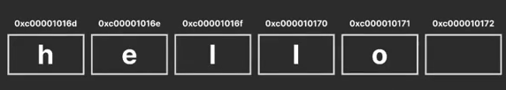
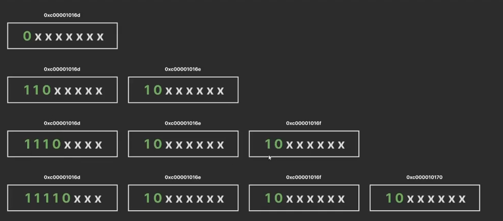

#  Основные конструкции языка

## Основные типы данных

**Целочисленные:** byte, int8, uint8, int16, uint16, int32, uint32 int64, uint64, rune  
**Вещественные:** float32, float64  
**Логический:** bool (1 байт)  
**Строковый**: string (8 байт -  т.к. является ссылкой)  
**Комплексные**: complex64, complex128 - вещественная и мнимая части 

!!! Под капотом:  
**rune** - хранит utf code points = 4byte  


## Что такое строки?

Строка GO - **cлайс** байтов, предназначеный для чтения, который может содержать байты любого типа и иметь произвольную длину. 
Это изменяемый объект. Когда создается новая строка(или конкатинируются строки), создается новый объект (слайс).

Каждая буква - это число из ASCII таблицы



Символы, которые кодируются двумя, тремя и четырмя байтами:




## Что такое iota?

Специальная конструкция языка, которая автоматически увеличивается на единицу в каждом новом объявлении константы внутри одного блока const
```
const (
    a = iota // 0 
    _        // пропуск
    c        // 2
)
```

## Что такое составной тип? Какие составные типы в языке go существуют?

**Составной тип** - тип, который состоит из одного или нескольких других типов, объединяя их в более сложные структуры данных.

В go выделяют:
- массивы - фиксированный набор элементов
- срез/слайс - динамический гибкий массив, который может менять размер
- структуры - набор полей любых типов, объединенных под одним именем
- мапа - ассоциативный массив, хранящий пары клюс-значение
- каналы - структура обмена данными между горутинами
- указатели - тип данных, хранящий значение других переменных
- функции - тоже является составным типом, поскольку может быть присвоен переменной
- интерфейсы - тип для описания набора методов, которые должны быть реализованы


## Какие типы можно сравнивать в Go?

Все которые удовлетворяют интерфейсу comparable

0. Примитивы. Сравниваются напрямую.
1. Массивы (не слайсы!). Можно сравнивать, если элементы сравнимы. 
2. Структуры. Сравниваются по значениям всех полей, если элементы сравнимы.
3. Указатели. Сравниваются между собой и с nil
4. Интерфейсы
5. Каналы

**Важно!** Словари и слайсы сранивать нельзя, т.к. это ссылки на динамические структуры, что делает сравнение содержимого очень дорогим и неочевидным (может содержать разные данные, занимающие одну область памяти)


<br>
<br>

[>>> Назад <<<](../README.md)