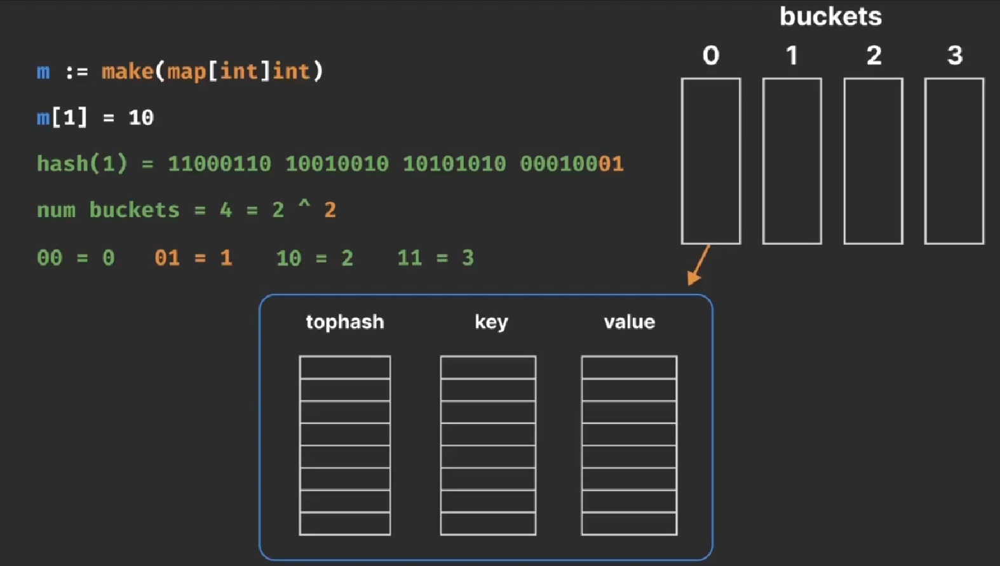
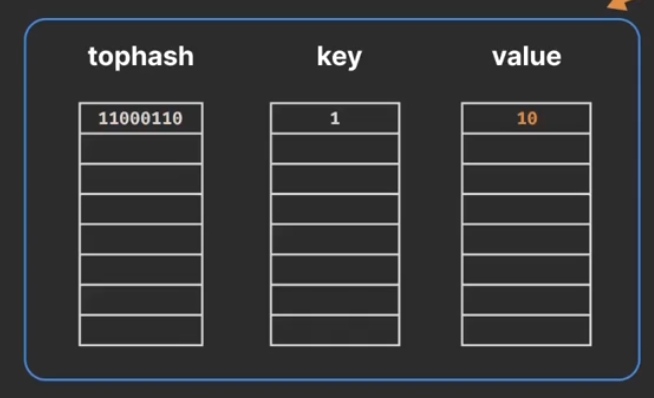
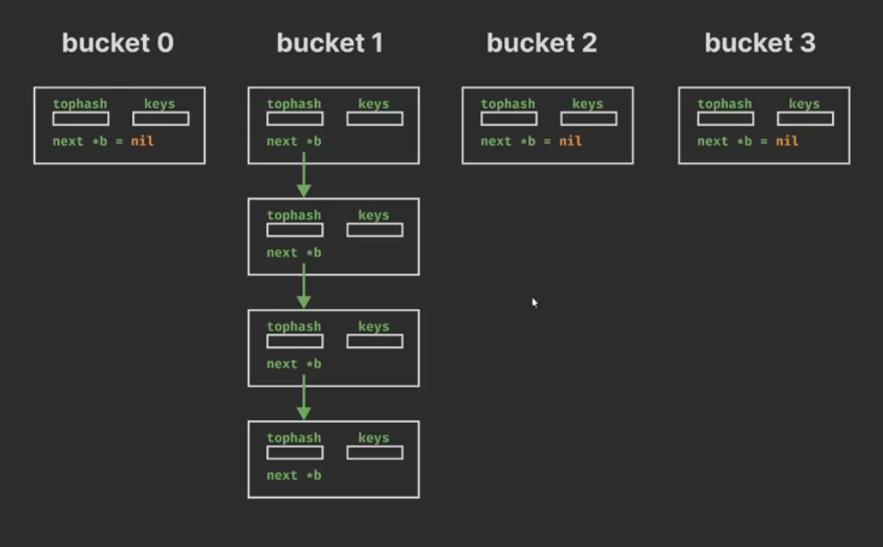
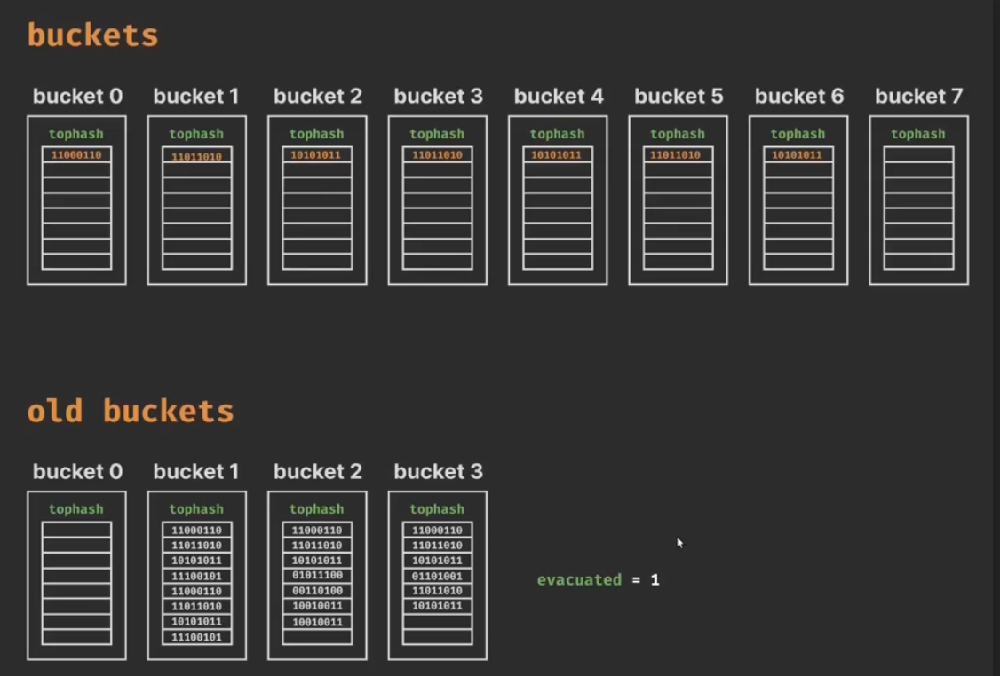

# Массивы и слайсы

## Что такое массив?

Составной тип данных, который содержит однородные элементы, имеет фиксированный размер и **не расширяемый**.

`[n]T` - массив из n элементов типа T  

Нулевое значение - массив проинициированный дефолтными значениями типа T


## Устройство массива

Массив - это непрерывный блок памяти, без скрытых указателей, capacity и т.д. Но у него можно получить длину, через встроенную функцию `len()`

Важно, что при копировании копируется целиком. 


## Что такое слайс?

Реализация _динамического_ массива, который можно расширять.  
  
Составной тип данных  
Ссылочный тип данных  

В основе слайса которого лежит массив, обладающий следующими элементами:  
**ptr** - указатель на область памяти, на массив или на элемент массива с которого начинается слайс  
**len** - длина массива  
**cap** - вместимость массива  

Нулевое значение - `nil`

```golang
type slice struct {
    array unsafe.Pointer
    len int
    cap int
}
```

## Почему проверка слайса на nil возможна?

Для того, чтобы проверить массив на nil не обязательно обращаться к полю-ссылке, а можно написать простую контсрукцию
```golang
var a []int
if a != nil {
    ...
}
```

Это специально сделанный синтаксический сахар


## Как меняется длина слайса при добавлении элементов? (функция append)

1. При добавлении элемента вычисляется новая длина, которая сравнивается с текущей capacity
2. Если новая длина больше емкостью, тогда 
    - выделяется новая память с емкостью `х2` (приблизительно)
    - меняем ссылку на новый массив в структуре, меняем len и cap

Рост происходит в 2 раза до количества элементов `threshold = 256`. Далее (где-то с 1000 элементов) `x1,25`. Между 256 и 1000 происходит плавный переход


## Как создать слайс?

`var s []int`  
`slice := []int{1,2,3}`  
`slice := make([]int, l, c)`, где _l_ - длина слайса, _c_ - размер капасити слайса  
`slice := make([]int, c)`, где _c_ - размер капасити слайса  


### Создать слайс из массива:
```
var array [n]T
slice = array[low:high:max]
```
где `low` - первый индекс массива, `high` - последний индекс массива/слайса, `max` - максимальный индекс слайса, из которого рассчитывается capacity нового слайса
  

##  Основные функции работы с слайсами

```
len(), cap(), append(), copy()
```

## Как превратить массив в слайс?

```
slice := array[:]
```

## Задачи

[Задача 1](note_5/ex_1/main.go)

[Задача 2](note_5/ex_2/main.go)  
Когда добавляем литералом массив с **нечетным количеством элементов больше 3х**, тогда _cap_ всегда больше на 1, чем _len_

[Задача 3](note_5/ex_3/main.go)  
[Задача 4](note_5/ex_4/main.go)  
[Задача 5](note_5/ex_5/main.go)  
[Задача 6](note_5/ex_6/main.go)  
[Задача 7](note_5/ex_7/main.go)  
[Задача 8](note_5/ex_8/main.go)  


<br>

# Map

## Что такое map?

Map - это неотсортированный контейнер данных со значениями типа ключ-значение

`map[T]E{ t1: e1, t2: e2, ...}`  

Время обращения к элементу по ключу - это O(1).  
Нулевое значение - `nil`.


## Что будет если обратиться к несуществующему элементу по ключу?

Словарь отдаст дефолтное значение.


## Как создать словарь?

Создание осуществляется через функцию `make`

```
m := make(map[T]E)
```


## Гарантирован ли порядок элементов в словаре? Почему?

Порядок **не гарантирован**. Это связано с тем, seed для hash функции получается рандомно каждый раз при старте приложения. 

Обход мапы тоже происходит в рандомной порядке. 


## Какой тип может быть ключом словаря? 

Только тот, который поддерживает сравнения друг с другом. 


## В чем преимущество использования map?

Операции добавления, удаления и поиска работают за константное время.


## Как устроена map?

`m := make(map[int]int)`

Создаются бакеты - структура массивов ограниченной длины. tophash, key, value - массивы 8 элементов.

### Вставка:   

По ключу один хотим добавить элемент `m[1] = 10` 

  

<br>


1. Для ключа рассчитывается уникальный hash с помощью hash-функции. Это значение определенной длины не зависимо от того, какой ключ.

    `hash(1) = 11000110 10010101 11001001 10111001`

2. Нужно узнать в какой бакет положить этот ключ и значение.  
    Для этого берем несколько бит с конца хэша - Low order bits - **01**  
     ${low\_order\_bits} = log_2 (N_{buckets})$ или $2^{low\_order\_bits} = N_{buckets}$


3. Потом вычисляется tophash - первый байт хэша. Кледается в массив tophash, key и value

  


**Сложность вставки:**

1. `hash(key)` - O(1) - специальная функция, которая сделана таким образом, чтобы принимать любой ключ и преобразовывать в ключ определенной длины
2. `LOB(hash(key))` - 01 - O(1) - с помощью побитовой операции
3. Взять первый байт от хэша - 0(1)
4. Добавить первый байт в массив tophash - O(1)
5. Добавить ключ и значение - O(1)

Итого: O(1)

Иногда случаются коллизии и тогда сложность O(N). Такое происходит, когда один бакет переполнен и запись начнется в прилинкованную структуру:

  

### Поиск по ключу

Хотим получить по ключу значение: `a := m[31]`
1. Получаем hash по ключу
2. Определяем номер bucket'a - получаем Low Bits Order
3. Поиск по tophash и получение значения

**Сложность поиска:**

1. `hash(key)` - O(1) 
2. `LOB(hash(key))` - O(1)
3. Взять первый байт от хэша - 0(1)
4. Сравнить первый байт с каждым элементом массива tophash - 0(8) = O(1)
5. Сравнить ключ с каждым элементом массива ключей - 0(8) = O(1)
6. Получить значение по тому же индексу, что и найденный ключ - 0(1)

Итого: O(1)

## Можем ли мы взять ссылку на элемент map?

Нет, не может. Т.к. есть процесс эвакуации данных.

## Эвакуация данных

Когда средняя заполненность бакета достигает значения `k = 6.5`, тогда создаются новые бакеты. Старые бакеты переименовываются в old buckets. Появляется параметр **evacuated**. 

Далее начинаем процесс эвакуации. В начале эвакуируем первый бакет в новые бакеты, параметр **evacuated** увеличиваем на 1. 

  

Продолжаем эту операцию, пока не переедут все old бакеты.

**Важно!** Так как данные могут эвакуироваться в любой момент, то мы не можем взять ссылку на ключ-значение, потому что они могут переехать.


## Задачи

[Задача 9](note_5/ex_9/main.go)  
[Задача 10](note_5/ex_10/main.go)  

[>>> Назад <<<](../README.md)