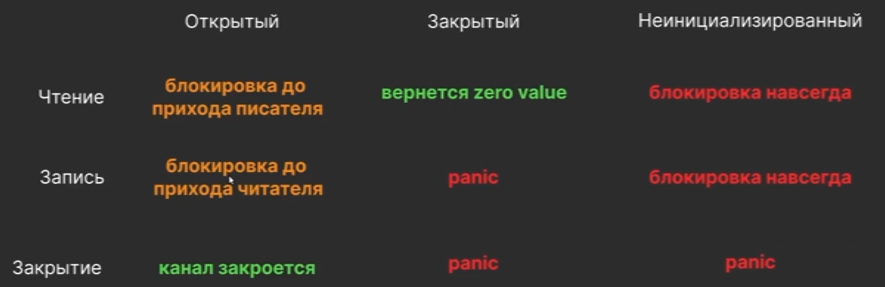
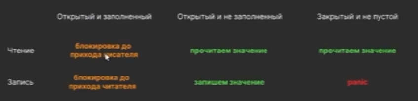

# Конкурентное программирование в GO

## Чем параллельность отличается от конкурентности?

**Параллельность** - возможность выполнять несколько потоков одновременно  
**Конкурентность** - возможность передавать управление другому потоку в процессе выполнения  


## Что такое горутина? Почему придумали концепцию горутин?

**Горутина** - это легковесный поток.   
**Горутина** - это структура, которая выполняет переданную ей функцию, которая содержит состояние куска кода и может выполняться конкурентно.    
**Горутина** - это функция, которая может запускаться конкурентно.  

1. Начальный размер стека 2 Kb, а не 1-8Mb
2. Нет необходимости следить за тем, какие операции очень "тяжелые"
3. Не обязательно сохранять все данные процесса ОС
4. Горутины не переключаются в момент интенсивной нагрузки процессора
5. Не нужно выполнять поход в ОС для переключения потока (Syscall)
6. Переключение потоков обычно занимает ~12k операций процессора(1.2-12 µs), тогда как переключение горутины обычно ~2.4k (100-500ns)


## Какие бывают проблемы с горутинами?

1. Синхронизация
2. Гонка
3. Утчека

## Как называется модель go конкуренции?

**Fork/join**


## Как синхронизировать горутины?

Самый простой способ - через _WaitGroup_.

```golang
func main() {
    wg := &sync.WaitGroup{}

    wg.Add(1)
    go func(){ // fork
        defer wg.DOne()
        // ...
    }()

    wg.Add(1)
    go foo() // fork

    // Join
    wg.Wait()
}

func foo(wg *sync.WaitGroup) {
    // если передать не по ссылке, тогда wg.Done будет выполнен для копии
    defer wg.Done
    // ...
}
```

[Пример](note_7/ex_2/main.go)  
   
## Что такое состояние гонки?

[Пример](note_7/ex_5/main.go)  

Параллельно запущенные горутины в один и тот же момент времени меняют одну переменную _m_


<br>
<br>

Как решить:
1. Использовать atomic переменные, если несколько горутин меняют одновременно одну переменную
2. Использовать sync.Mutex, если несколько операций связаны
3. Использовать sync.RWMutex (sync.RLock, sync.WLock) - лок на чтение или на запись

<br>

# Каналы

## Что такое канал?

**Канал** - это очередь сообщений FIFO, которая умеет работать в многопоточной среде.  

Существуют каналы двух типов:

- **Буферизованный канал** - канал в которым есть место для нескольких сообщений:

```golang
bufCh := make(chan bool, 10)
```

- **Небуферизованный канал** создаются по умолчанию. Пока кто-то не начал читать из этого канала, записать туда не получится.

```golang
сh := make(chan bool)
```

[Пример](note_7/ex_1/main.go)  

**Небуфферизиварованный канал** - это концепция, которая включает:  
    - разделение на роли (читатели и писатели)  
    - любое количество участников в рамках одной роли  
    - конкурентно-безопасная передача данных от писателя к читателю "из рук в руки"  
    - блокирующее ожидание при отсутствии "второй стороны"  
    - очереди ожидания консьюмеров/продюссеров  


**Важно!**
- Обычный канал используется, когда передача данных между горутинами - это конечная цель коммуникации.  
- Буфферизованный канал используется, когда горутины передают друг другу служебную информацию об определенном ограничении (rate limiter)
- Использование канала с буферами только для передачи данных - возможно, но это лишний overhead


## Аксиомы каналов

### Небуфферизированный

[пример](note_7/ex_7/main.go)  


  
### Буфферизированный




## Правила работы с каналами

1. Закрывает канал тот, кто пишет в него (см. генератор)
2. Если пишет несколько продюссеров, тогда канал закрывает тот, кто создал его
3. Не закрытый канал держит ресурсы, их нужно закрывать явно!


## Оператор select

**Блокирующий** оператор для выбора канала из которого нужно/хотим читать. Чтение производится **один раз**. 
```golang 
select {
	case v := <-ch1:
		fmt.Println("v =", v, "from ch1")
	case v := <-ch2:
		fmt.Println("v =", v, "from ch2")
	case <-time.After(1 * time.Second):
		fmt.Println("exited by time after")
	case <-timer.C:
		fmt.Println("exited by timer")
	case <-ctx.Done():
		fmt.Println("exited by context")
	case <-ch3:
		fmt.Println("exited by channel")
	default:
		fmt.Println("exited by default")
	}
```

## Что такое утечка горутин?

Утечка горутины возникает, когда результат работы горутины никому не нужен, но горутина работает и потребляет ресурсы. 

Примеры утечек:
```golang
func leakGoroutine() {
	go func() {
		select{}
	}()

	go func() {
		for {}
	}()
}
```
Интересный [пример](../_tasks/ex_11/main.go)

### Профилактика утечек горутин

1. Завершать работу горутины, когда от нее всё получили
2. Завершать работу горутины, если она не может продолжать работу из-за ошибки
3. Завершать горутину по отмене контекста родительской горутины

Классический [пример](../_tasks/ex_12/main.go)


## Как обнаружить утечки

1. [goleak](../_tasks/ex_13/main.go)
2. Использовать метрики подсчета горутин [пример](../_tasks/ex_14/main.go)
3. pprof, prometheus, .. 


## Примитивы синхронизации

- Каналы
- Пакет sync
	- **sync/atomic** - низкоуровневый примитив. Используется для построения других примитивов. Можно использовать в простых кейсах, но в сложных сценариях не рекомендуется.
	- **sync.Mutex**, **Sync.RWMutex** - нужны для обеспечения конкурентного доступа к общим ресурсам.
	- **sync.WaitGroup**
	- **sync.Map** - потокобезопасная мапа. хороша при read-intensive
	- **sync.Pool** - полезен, когда у нас много аллокаций крупных объектов, для **снижение нагрузки на сборщик мусора**
	- **sync.Once** - когда хотим, чтобы действие было выполнено один раз
	- **sync.Cond** - предназначен для обмена сигналами между горутинами.


## Как работают атомики? 

Атомики используют барьеры памяти acquire и release, а также атомарные инструкции на уровне процессора. Таким образом достигается последовательное выполнение атомарных операций в многопроцессорной среде.

Популярные атомарные операции, которые выполняются на уровне процессора:
- load()
- store()
- add()
- compareAndSwap()
- swap()


<br>
<br>
<br>  

[>>> Назад <<<](../README.md)