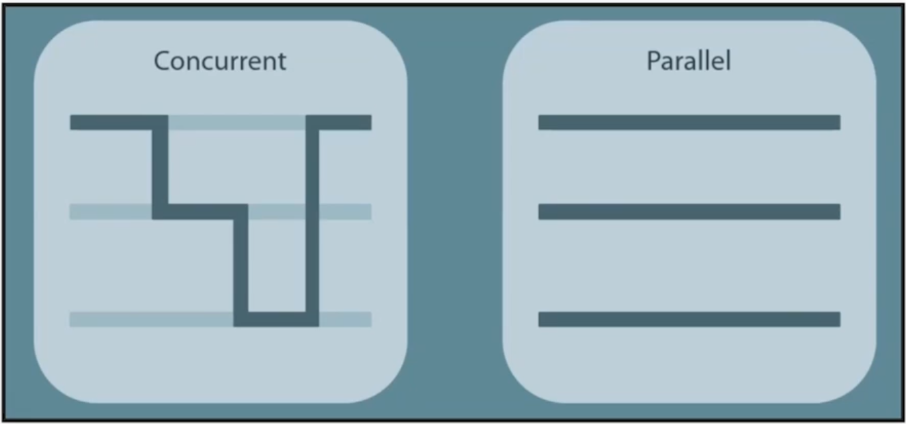
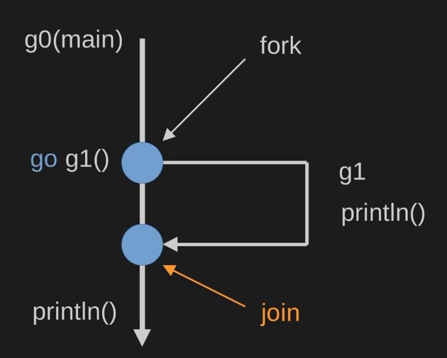
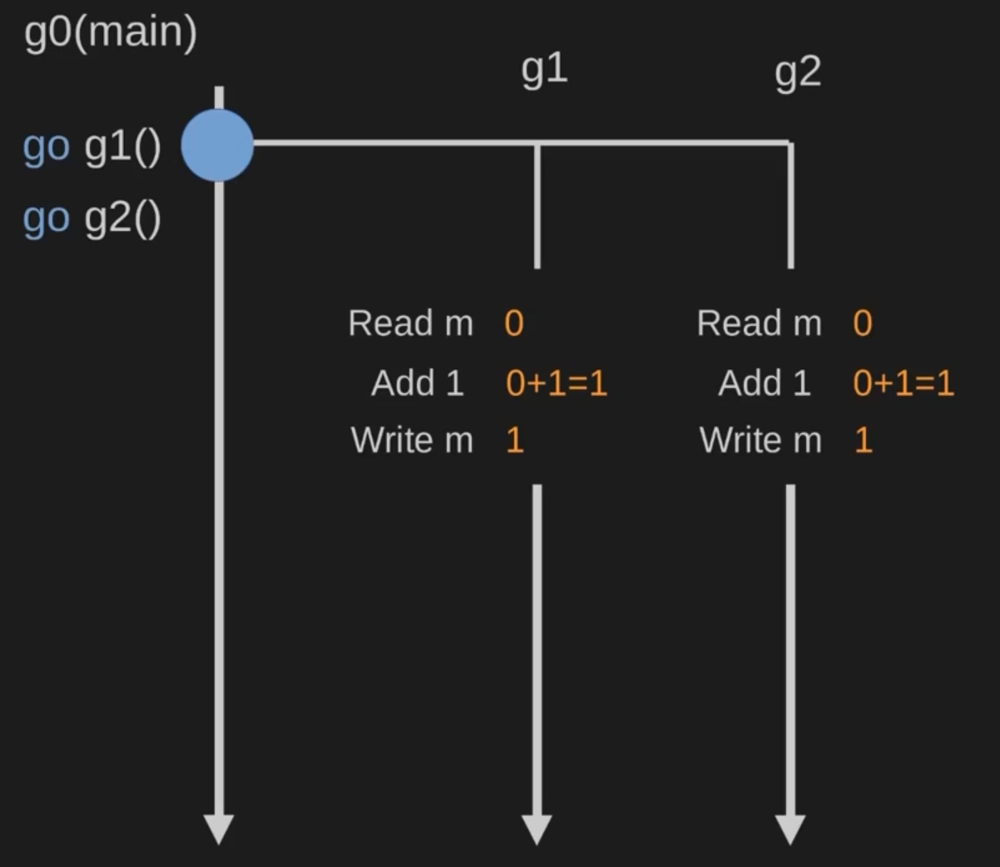
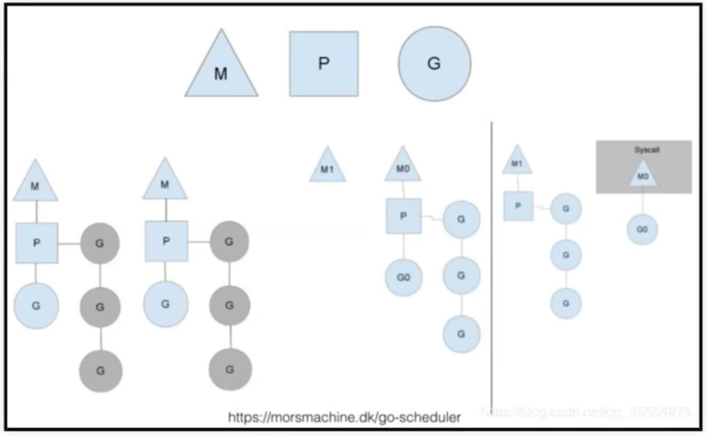

# Конкурентное программирование в GO

## Чем параллельность отличается от конкурентности?

**Параллельность** - возможность выполнять несколько потоков одновременно  
**Конкурентность** - возможность передавать управление другому потоку в процессе выполнения  



## Что такое горутина? Почему придумали концепцию горутин?

**Горутина** - это легковесный поток.   
**Горутина** - это структура, которая выполняет переданную ей функцию.  
**Горутина** - это функция, которая может запускаться конкурентно.  

1. Переключение потоков обычно занимает ~12k операций процессора, тогда как переключение горутины обычно ~2.4k
2. Нет необходимости следить за тем, какие операции очень "тяжелые"


## Проблемы с горутинами

1. Синхронизация
2. Гонка
3. Утчека

## Как называется модель go конкуренции?

**Fork/join**



## Синхронизация горутин

Самый простой способ - через _WaitGroup_.

```golang
func main() {
    wg := &sync.WaitGroup{}

    wg.Add(1)
    go func(){ // fork
        defer wg.DOne()
        // ...
    }()

    wg.Add(1)
    go foo() // fork

    // Join
    wg.Wait()
}

func foo(wg *sync.WaitGroup) {
    // если передать не по ссылке, тогда wg.Done будет выполнен для копии
    defer wg.Done
    // ...
}
```

[Пример](note_7/ex_2/main.go)  
   
## Состояние гонки

[Пример](note_7/ex_5/main.go)  

Параллельно запущенные горутины в один и тот же момент времени меняют одну переменную _m_



Как решить:
1. Использовать atomic переменные, если несколько горутин меняют одновременно одну переменную
2. Использовать sync.Mutex, если несколько операций связаны
3. Использовать sync.RWMutex (sync.RLock, sync.WLock) - лок на чтение или на запись


## Runtime go (Как работает шедулер в Go)

- Для каждого виртуального ядра go создает виртуальный процессор P
- Для каждого из этих процессоров создается поток M, который привязан к данному процессору и создается на нем. По умолчанию go создает число потоков равное количеству процессоров.
- Горутина G создаются строго по необходимости.



Управление G осуществляется шедулером Go, а не ОС. Переключение может быть выполнено в следующих случаях:
- Запуск новой горутины
- Сборка мусора
- Операция синхронизации
- Системный вызов

<br>
<br>

# Каналы

## Что такое канал?

**Канал** - это очередь сообщений FIFO, которая умеет работать в многопоточной среде.  

Существуют каналы двух типов:

- **Буферизованный канал** - канал в которым есть место для нескольких сообщений:

```golang
bufCh := make(chan bool, 10)
```

- **Небуферизованный канал** создаются по умолчанию. Пока кто-то не начал читать из этого канала, записать туда не получится.

```golang
сh := make(chan bool)
```

[Пример](note_7/ex_1/main.go)  

**Небуфферизиварованный канал** - это концепция, которая включает:
    - разделение на роли (читатели и писатели)
    - любое количество участников в рамках одной роли
    - конкурентно-безопасная передача данных от писателя к читателю "из рук в руки"
    - блокирующее ожидание при отсутствии "второй стороны"
    - очереди ожидания консьюмеров/продюссеров


**Важно!**
- Обычный канал используется, когда передача данных между горутинами - это конечная цель коммуникации.  
- Буфферизованный канал используется, когда горутины передают друг другу служебную информацию об определенном ограничении (rate limiter)
- Использование канала с буферами только для передачи данных - возможно, но это лишний оверхед
- 


## Что произойдет при чтении из пустого канала?

Горутина уснет. 

## Что произойдет при записи в закрытый канал?

Паника/deadlock

### Что произойдет при чтении из закрытого канала?

Значение по умолчанию.

## Паттерны использования

[примеры](note_6/ex_3/main.go)  

1. Сбор данных из нескольких историчников  
2. Раздача данных для обработки нескольким воркерам
3. Сихронизация поток выполнения

## Праивила работы с каналами

1. Закрывает канал тот, кто пишет в него
2. Если пишет несколько продюссеров, тогда канал закрывает тот, кто создал его
3. Не закрытый канал держит ресурсы, их нужно закрывать явно!


[>>> Назад <<<](../README.md)