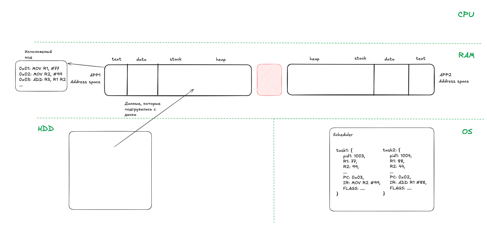
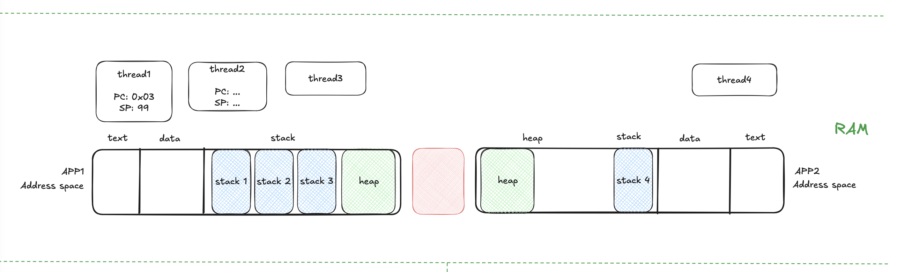
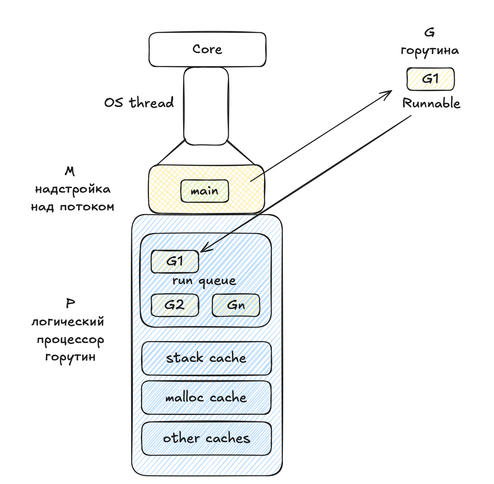
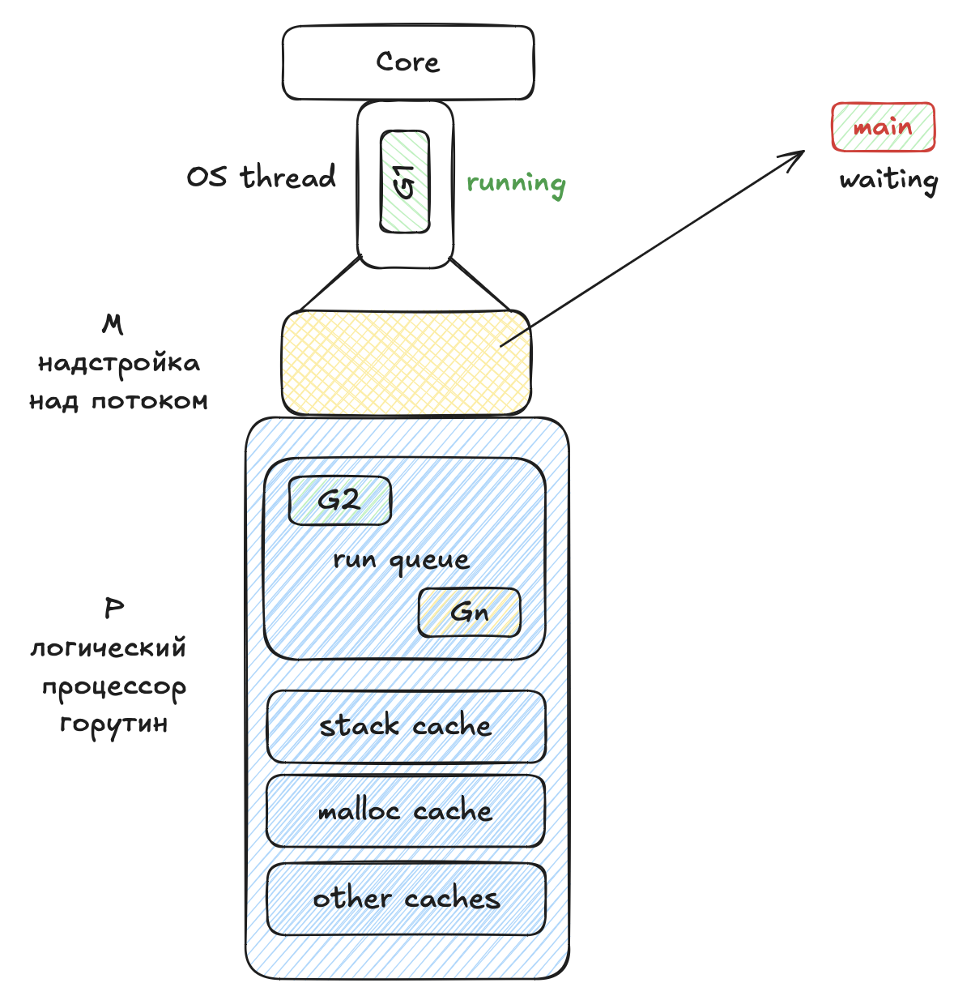
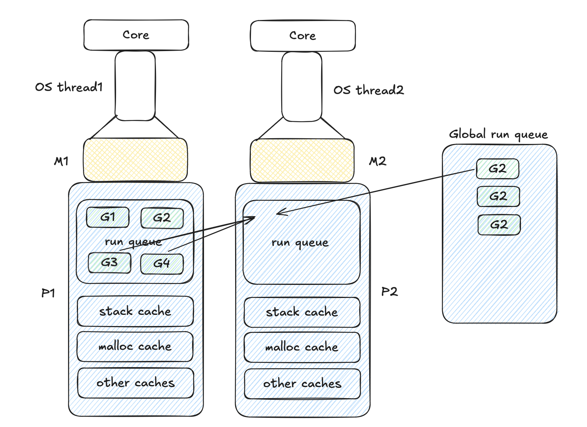
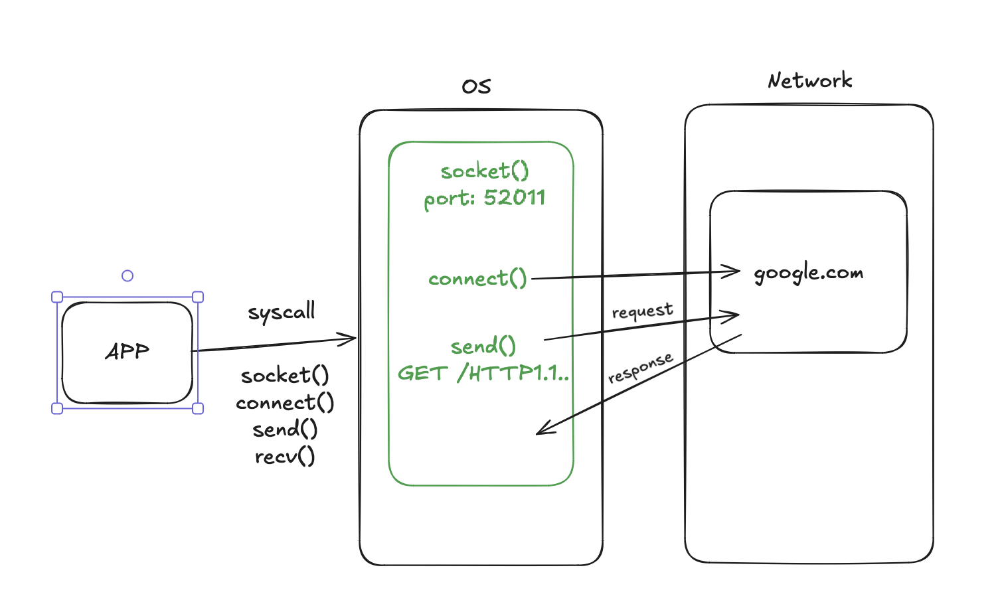
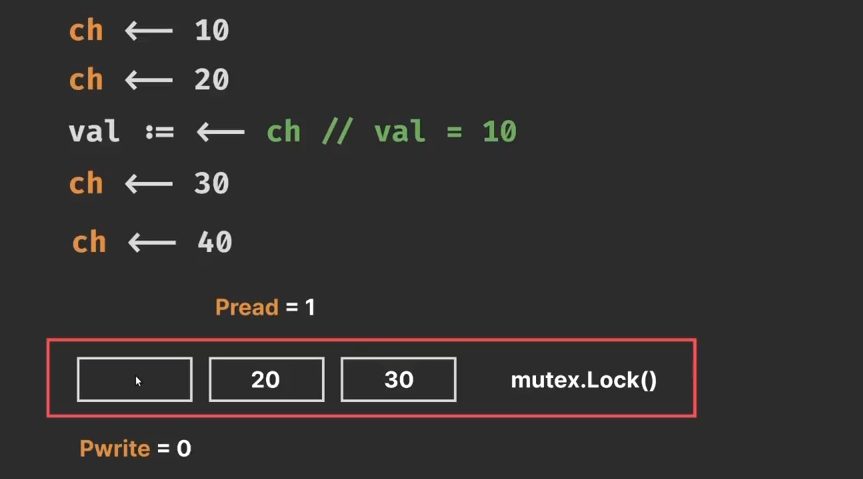

# Планировщик и горутины

## Процессы операционной системы

Запущенные приложения или их часть, которые загрузились в оперативную память, называются **процессом**. У каждого процесса своя область памяти. 

Управлением выполнения заданий для процессора занимается **планировщик** операционной системы. Дригими словами планировщик переключает **таски** - **процессы**.

Когда планировщик снимает с выполнения одну таску и переключается на другую называется **вытесняющая конкурентность**.




## Потоки операционной системы

У каждого процесса своя область памяти, но потоки процесса могут шарить память между собой. 

Каждый поток - это тоже структура, в которой есть Program counter, stack pointer и тд

Планировщик в современных приложениях работает с потоками



Context Switch (1-10 µs) - переключение процессов/потоков  
Mode switch (Syscall) (0.1-1 µs) - приложение инициирует переключение контекста  


## Зачем нужен свой планировщик?

1. Не давать разработчику потоки
2. Эффективно использует ресурсы процессора и кэшей за счет оптимизации
    - пул потоков - не тратиться время на создание потоков
    - добавление новых горутин в очередь текущего процесса
    - кэши логических процессов
    - work stealing - логические процессоры не простаивают, а активно ищут работу
3. Эффективная работа с network I/O


## Планировщик в GO

Это NxM планировщик. На M потоков мапится N горутин. Количество горутин больше, чем количество потоков.

Количество логических процессоров (P) изначально (по умолчанию) равно количеству ядер процессора. Регулируется настройкой **GOMAXPROCS**.

Планировщик GO реализует **кооперативную многозадачность**. В состоянии waiting горутина имеет причину остановки waitReason. В зависимости от причины планировщик принимает решение, что делать с горутиной. 

### Алгоритм работы

Горутина создается в статусе IDLE и сразу же переходит в статус Runnable и становится в очередь _run queue_. 



Если получаем инструкцию на приостановку горутины main, тогда она снимается с выполнения и переходит в статус waiting. Начинают выполняться горутины из очереди.




Логический процессор, когда понимает, что незагружен, забирает часть задач себе. 
Если в локальной очереди логического процессора нет горутин, тогда забирает горутину из **глобальную очередь**. Если там нет активных горутин, тогда просматривается **netpoller**. Если и там нет горутин, тогда процессор забирает _половину_ горутин у соседнего локального процессора. Этот процесс называется **work stealling**.




## Синхронный syscall

Например, чтение с диска. 

Если возникает блокирующая операция, тогда планировщик отключает текущий поток и создает новый поток, в котором начинает разбираться очередь из горутин. Отключенный поток продолжает выполнять операцию (например, чтение с диска). Когда операция заканчивается, поток освобождается, горутина возвращается в очередь.  


## Acинхронный syscall

Например, сетевые запросы

Синхронное взаимодейтсвие с сетью: 



При ассинхронном взаимодействии приложении отправляет команду на создание группы сокетов и не ждет, пока сокет приконнектиться с серверу, а продолжает выполнять другие задачи, переодически посылая `epoll_wait()`. Как только сокеты готовы к подключению, приложение считывает эти порты и отправляет connect() сразу по всем доступным портам. И продолжает выполнять другие задачи. Так происходит и с остальными методами.

**netpoller** - механизм, работающий на одном единственном потоке, использующий epoll_. Механизм используется для работы с сетью. 


## Как устроен Mutex?

Построен на атомиках и включает:
1. locked - атомарный флаг
2. цикл с CompareAndSwap при попытке залочить

```golang
type myMutex struct {
	locker int64
}

func (m *myMutex) Lock() {
	for {
		if atomic.CompareAndSwapInt64(&m.locker, 0, 1) {
			return
		}
	}
}

func (m *myMutex) Unlock() {
	atomic.StoreInt64(&m.locker, 0)
}

func main() {
	wg := &sync.WaitGroup{}
	mu := myMutex{}

	wg.Add(1000)
	c := 0
	for range 1000 {
		go func() {
			defer wg.Done()

			mu.Lock()
			c++
			mu.Unlock()
		}()
	}
	wg.Wait()

	f
```


## Как устроен канал?

Атомарный флаг - закрыт или открыт канал  
Очередь горутин на чтение и на запись  
Мьютекс  
Кольцевой буфер   




<br>
<br>
<br>  

[>>> Назад <<<](../README.md)