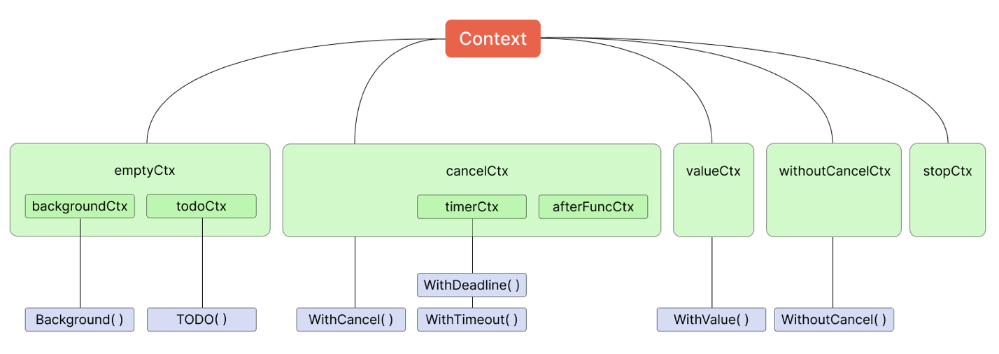

## gRPC

gRPC (google Remote Protocol Call) - это современный фреймворк для удаленных вызовов процедур от компании google.

gRPC использует удобный формат Protocol Buffers (protobuf) - компактный и быстрый 

Преимущества:
1. HTTP/2 и эффективность работы
2. Кроссплатформенность
3. Годогенерация
4. Поддержка и сообщество

По сути в http/2:
- бинарный протокол, а не текст
- сжатые заголовки
- мультиплексирование, а не несколько соединений. при этом каждый запрос не ждет другого.

## Контекст

Контекстом называют интерфейс Context из пакета context. Его обычно используют для следующих целей:

- чтобы установить дедлайн выполнения кода
- оповещать об окончании исполнения блока кода
- узнать причину отмены контекста
- получить значение по ключу

```golang
type Context interface {
	Deadline() (deadline time.Time, ok bool)
	Done() <-chan struct{}
	Err() error
	Value(key any) any
}
```



Создание корневого контекста:
```golang
context.TODO()
context.Background()
```

Создание нового контекста:
```golang
WithCancel, WithDeadline, WithTimeout, WithValue и WithoutCancel
```

Обработка ошибок:
```golang
context.Err()
context.Done()
```

